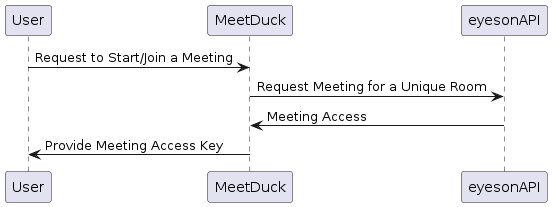

## Christoph Lipautz

::: columns
:::: column
Software Engineer at [eyeson.com](https://www.eyeson.com) \
\
Plan, Build, and Maintain Software Services
::::
:::: column

::::
:::

## Our Use Case

**Inter-Company Remote Communication**

In our company, internally we want to...

- get rid of restrictions given by any 3rd-party tools
- manage (store, extend, link) our data ourselves
- connect internal software to get the most out of it

## Requirements

Implement a **video meeting web platform** that manages **workspaces**
(topics, projects) to deal with **remote intercommunication**.

## Overview, by Business Value

1. Video Communication: Let's start to Meet

2. Authentication: User Handling

3. Content Management: Meeting Assets

## Tech. Prerequisites

go ... Statically Typed, Cross-Platform Programming Language

eyeson ... Video Meetings API

fiber ... Web Framework

gorm ... ORM, Database Abstraction, Driver SQLite

## eyeson API Key

Grab a free community API key at [developers.eyeson.team](http://developers.eyeson.team/)

\centering {width=80%}

## Start a Meeting using eyeson

```sh
$ curl -X POST \
  -H "Authorization: $API_KEY" \
  -d "id=workspace-one" \
  -d "name=Marketing Team" \
  -d "user[name]=Alice" \
  "https://api.eyeson.team/rooms" | jq ".links.gui"

$ curl -X POST \
  -H "Authorization: $API_KEY" \
  -d "id=workspace-one" \
  -d "user[name]=Bob" \
  "https://api.eyeson.team/rooms" | jq ".links.gui"
```

## eyeson Single Stream

\centering {width=100%}

## fiber

```go
// https://docs.gofiber.io/
app.Get("/workspaces", func(c *fiber.Ctx) error {
  // ...
}
```

## gorm

```go
// https://gorm.io/docs/
type Workspace struct {
  ID    uint
  Topic string
}

workspace := Workspace{Topic: "Support Team"}
db.Create(&workspace)

var supportWorkspace Workspace
db.Where("topic = ?", "Support Team")
  .First(&supportWorkspace)
```

## Project: Meet, the Duck

\centering {height=80% align=center}

## Project Specs #1

As an **employee** \
I want to **manage workspaces** \
in order to **remote communicate** with colleagues

## Workspaces #1

::: columns
:::: column
\centering Let's start to Meet
::::
:::: column
{width=50%}
::::
:::

<!--
Step-0 Finished at 00:30:00
Step-1 Finished at 00:50:00
-->

## eyeson Default Web UI Flow

\centering 

## eyeson Default Web UI

::: columns
:::: column
Quickstart Application, Forward and Redirect Back, Configurable with
Limitations
\
\
Pre-Build with: Presentations and Drawing, Snapshots, Recordings,
Virtual Background, Gif Reactions(!), Chat, Device Management, Layout
Management, Broadcast (Streaming) Control, ...
::::
:::: column
\centering 
::::
:::

## Authentication Specs #2

As an **employee** \
I want to provide my **company email** \
in order to receive a **login link**

## Authentication #2

::: columns
:::: column
\centering Handle Users
::::
:::: column
{width=80%}
::::
:::

<!--
Step-2 Finished at 01:30:00
-->

## eyeson Custom UI Flow

\centering 

## eyeson Custom UI

- Use own Styles w/o any Restrictions

- Add Custom Features

- Integrate in an Existing Platform

## Meeting Data Management

How to Create a **History of Events**?

## Webhook Data Flow

\centering {width=80%}

## Content Management Specs #3

As an **employee** \
I want to review **past events** \
in order to **recall information**

## Content Management #3

::: columns
:::: column
\centering Receive Webhook Data
::::
:::: column
{width=50%}
::::
:::

<!--
Step-3 Finished at 01:45:00
-->

## Webhooks Delivery

- Meeting Details

  - New Meeting has Started (e.g. Trigger Events, Start Hard-Limit Shutdown
    Timer)

  - A Meeting has Ended (e.g. Create Record for History)

- Recording to Download

- Snapshots to Download

## Conclusion

- We can run our own **video meetings with a few lines of code**.

## Conclusion

- We can run our own **video meetings with a few lines of code**.

- Our platform can deal with custom **authentication and authorization easily**.

## Conclusion

- We can run our own **video meetings with a few lines of code**.

- Platform can deal with custom **authentication and authorization easily**.

- Handling **meeting assets is straightforward**.

## The Full Picture

\centering github.com/eyeson-team/meetduck

\centering {width=100%}

## Questions? Comments? Suggestions?

[github.com/eyeson-team](https://github.com/eyeson-team)

[developers.eyeson.team/](https://developers.eyeson.team/)

[docs.gofiber.io](https://docs.gofiber.io/)

[gorm.io/docs](https://gorm.io/docs/)

[npmjs.com/package/eyeson](https://www.npmjs.com/package/eyeson)

[github.com/eyeson-team/eyeson-go](https://github.com/eyeson-team/eyeson-go)

[eyeson-team.github.io/api/](https://eyeson-team.github.io/api/)
